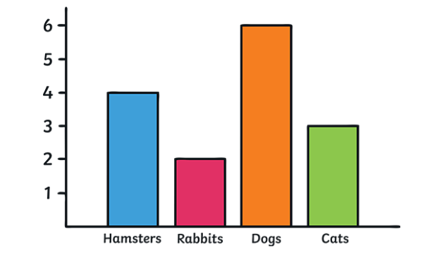
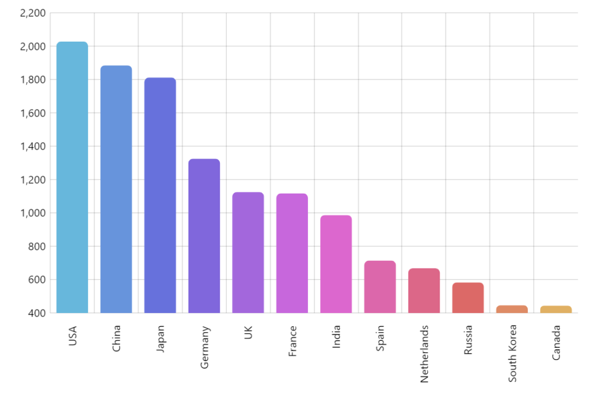

# Components

This chapter demonstrates the syntax of common components of a book written in **Bookless**. The approach is based on Pandoc, so we start with the syntax of Pandoc's flavor of Markdown.

## Markdown syntax

In this section, we give a very brief introduction to Pandoc's Markdown. Readers who are familiar with Markdown can skip this section. The comprehensive syntax of Pandoc's Markdown can be found on the [Pandoc website][pandoc-website].

### Inline formatting

You can make text _italic_ by surrounding it with underscores or asterisks, e.g., `_text_` or `*text*`.

For **bold** text, use two underscores (`__text__`) or asterisks (`**text**`).

Text surrounded by `~` will be converted to a subscript (e.g., `H~2~SO~4~` renders H~2~SO~4~), and similarly, two carets (`^`) produce a superscript (e.g., `Fe^2+^` renders Fe^2+^).

To mark text as `inline code`, use a pair of backticks, e.g., `` `code` ``.^[To include literal backticks, use more backticks outside, e.g., you can use two backticks to preserve one backtick inside: ``` `` `code` `` ```.] 

Small caps can be produced by the HTML tag `span`, e.g., `<span style="font-variant:small-caps;">Small Caps</span>` renders <span style="font-variant:small-caps;">Small Caps</span>.

Links are created using `[text](link)`, e.g., `[RStudio](https://www.rstudio.com)`, and the syntax for images is similar: just add an exclamation mark, e.g., ``.

Footnotes are put inside the square brackets after a caret `^[]`, e.g., `^[This is a footnote.]`.

### Block-level elements

Section headers can be written after a number of pound signs, e.g.,

```markdown
# First-level header

## Second-level header

### Third-level header
```

If you do not want a certain heading to be numbered, you can add `{-}` after the heading, e.g.,

```markdown
# Preface {-}
```

This may cause the chapter doesn't have correct chapter name on the page header. You need to add a TeX command to an unnumbered header to fix this:

```markdown
# Preface {-}
\markboth{}{}
```

Unordered list items start with `*`, `-`, or `+`, and you can nest one list within another list by indenting the sub-list by four spaces, e.g.,

```markdown
- one item
- one item
- one item
    - one item
    - one item
```

The output is:

- one item
- one item
- one item
    - one item
    - one item

Ordered list items start with numbers (the rule for nested lists is the same as above), e.g.,

```markdown
1. the first item
2. the second item
3. the third item
```

The output does not look too much different with the Markdown source:

1. the first item
2. the second item
3. the third item

Blockquotes are written after `>`, e.g.,

```markdown
> "I thoroughly disapprove of duels. If a man should challenge me,
  I would take him kindly and forgivingly by the hand and lead him
  to a quiet place and kill him."
>
> --- Mark Twain
```

The actual output (we customized the style for blockquotes in this book):

> "I thoroughly disapprove of duels. If a man should challenge me,
  I would take him kindly and forgivingly by the hand and lead him
  to a quiet place and kill him."
>
> --- Mark Twain

Plain code blocks can be written after three or more backticks, and you can also indent the blocks by four spaces, e.g.,

````markdown
```
This text is displayed verbatim / preformatted
```

Or indent by four spaces:

    This text is displayed verbatim / preformatted
````

### Math expressions

Inline LaTeX equations can be written in a pair of dollar signs using the LaTeX syntax, e.g., `$f(k) = {n \choose k} p^{k} (1-p)^{n-k}$` (actual output: $f(k)={n \choose k}p^{k}(1-p)^{n-k}$); math expressions of the display style can be written in a pair of double dollar signs, e.g., `$$f(k) = {n \choose k} p^{k} (1-p)^{n-k}$$`, and the output looks like this:

$$f\left(k\right)=\binom{n}{k}p^k\left(1-p\right)^{n-k}$$

You can also use math environments inside `$ $` or `$$ $$`, e.g.,

```latex
$$\begin{array}{ccc}
x_{11} & x_{12} & x_{13}\\
x_{21} & x_{22} & x_{23}
\end{array}$$
```

$$\begin{array}{ccc}
x_{11} & x_{12} & x_{13}\\
x_{21} & x_{22} & x_{23}
\end{array}$$

```latex
$$X = \begin{bmatrix}1 & x_{1}\\
1 & x_{2}\\
1 & x_{3}
\end{bmatrix}$$
```

$$X = \begin{bmatrix}1 & x_{1}\\
1 & x_{2}\\
1 & x_{3}
\end{bmatrix}$$

```latex
$$\Theta = \begin{pmatrix}\alpha & \beta\\
\gamma & \delta
\end{pmatrix}$$
```

$$\Theta = \begin{pmatrix}\alpha & \beta\\
\gamma & \delta
\end{pmatrix}$$

```latex
$$\begin{vmatrix}a & b\\
c & d
\end{vmatrix}=ad-bc$$
```

$$\begin{vmatrix}a & b\\
c & d
\end{vmatrix}=ad-bc$$


## Figures

```
\
```

Generate this image:

\

If you want to create a figure, remove the last backslash:

```

```


## Tables

```markdown
Table: A simple table in Markdown.

|Sepal.Length| Sepal.Width | Petal.Length | Petal.Width |
|------------|-------------|--------------|-------------|
|        5.1 |          3.5|           1.4|          0.2|
|        4.9 |          3.0|           1.4|          0.2|
|        4.7 |          3.2|           1.3|          0.2|
|        4.6 |          3.1|           1.5|          0.2|
|        5.0 |          3.6|           1.4|          0.2|
|        5.4 |          3.9|           1.7|          0.4|
```

Will generate the table below.


Table: A simple table in Markdown.

|Sepal.Length| Sepal.Width | Petal.Length | Petal.Width |
|------------|-------------|--------------|-------------|
|        5.1 |          3.5|           1.4|          0.2|
|        4.9 |          3.0|           1.4|          0.2|
|        4.7 |          3.2|           1.3|          0.2|
|        4.6 |          3.1|           1.5|          0.2|
|        5.0 |          3.6|           1.4|          0.2|
|        5.4 |          3.9|           1.7|          0.4|